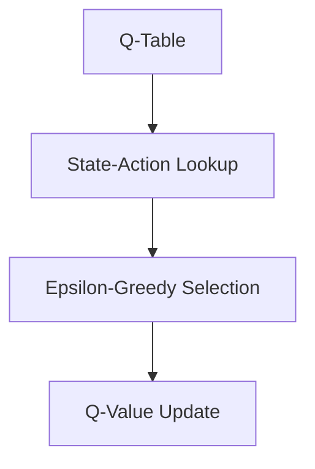
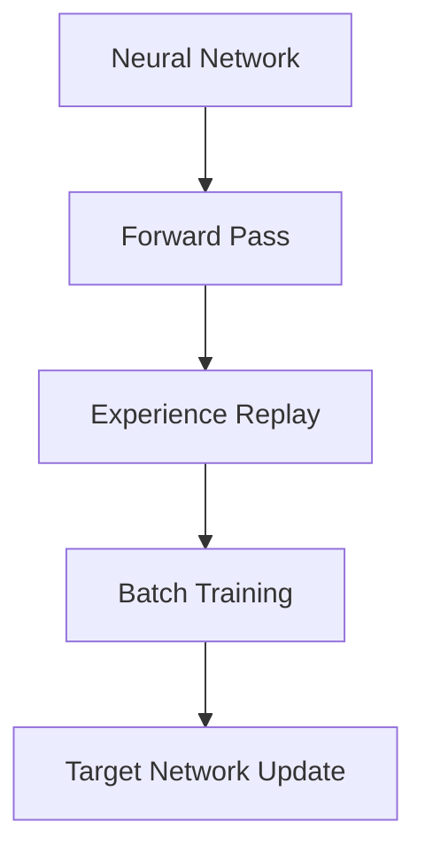

# Dokumentation und Entwicklung

## Lokale Dokumentation

```bash
# Entwicklungsmodus starten
mkdocs serve
# Verfügbar unter: http://127.0.0.1:8000

# Statische HTML-Dateien generieren  
mkdocs build

# Dokumentation mit Auto-Reload
mkdocs serve --dev-addr=127.0.0.1:8001
```

## Dokumentationsstruktur

```
docs/
├── index.md              # Projektübersicht und Algorithmus-Vergleich
├── setup.md              # Installation für Q-Learning und DQN  
├── funktionsweise.md     # Q-Learning und DQN Algorithmus-Details
├── training.md           # Training beider Algorithmen und Vergleiche
├── visualisierung.md     # Analyse-Tools für beide Algorithmen
└── dokumentation.md      # Diese Entwicklungsdokumentation
```

### Inhaltliche Abdeckung

| Datei | Fokus | Zielgruppe | Algorithmen |
|-------|-------|------------|-------------|
| **index.md** | Projektübersicht, Vergleich, Architektur | Alle Nutzer | Q-Learning + DQN |
| **setup.md** | Installation, Grundlagen, Troubleshooting | Neue Nutzer | Beide Algorithmen |
| **funktionsweise.md** | Algorithmus-Details, Module, Vergleich | Entwickler, Forscher | Q-Learning + DQN |
| **training.md** | Parameter, Szenarien, Best Practices | Praktische Anwendung | Beide + Vergleich |
| **visualisierung.md** | Plots, Exports, Interpretation | Analyse und Ergebnisse | Q-Learning + DQN |
| **dokumentation.md** | MkDocs, Entwicklung, Wartung | Entwickler | Projekt-Wartung |

## Projektarchitektur-Dokumentation

### Code-Struktur
```
ship-navigation-ql-dqn/
├── src/                           # Hauptcode
│   ├── q_learning/                # Q-Learning Implementation
│   │   ├── *.py                   # Q-Learning Ausführbare Scripts
│   │   ├── exports/               # Q-Learning spezifische Exports
│   │   └── utils/                 # Q-Learning Wiederverwendbare Module
│   │       ├── __init__.py       # Q-Learning Package mit Exports
│   │       ├── common.py         # Q-Learning Basis-Hilfsfunktionen
│   │       ├── environment.py    # Q-Learning Umgebungs-Management
│   │       ├── qlearning.py      # Q-Learning Algorithmus
│   │       ├── evaluation.py     # Q-Learning Bewertungslogik
│   │       ├── position.py       # Q-Learning Position/State Konvertierungen
│   │       ├── visualization.py  # Q-Learning Plotting-Funktionen
│   │       └── reporting.py      # Q-Learning Ausgabe-Funktionen
│   ├── dqn/                       # Deep Q-Learning Implementation
│   │   ├── deep_q_agent.py       # DQN Agent mit Neural Networks
│   │   ├── train.py              # DQN Training Scripts
│   │   ├── train_all_scenarios.py # DQN Batch Processing
│   │   └── exports/              # DQN spezifische Exports
│   ├── comparison/                # Algorithmus-Vergleich
│   │   ├── compare_algorithms.py # Q-Learning vs DQN Vergleich
│   │   └── exports/              # Vergleichs-spezifische Exports
│   ├── shared/                    # Gemeinsame Komponenten
│   │   ├── config.py             # Zentrale Konfiguration (beide Algorithmen)
│   │   └── envs/                 # Gemeinsame Umgebungs-Implementierungen
│   │       ├── __init__.py       # Shared Envs Package-Initialisierung
│   │       ├── grid_environment.py # Standard Grid-Umgebung
│   │       └── container_environment.py # Container Pickup/Dropoff
│   └── experiments/               # Wissenschaftliche Experimente
├── docs/                          # MkDocs Dokumentation
├── exports/                       # Legacy/Gemeinsame Visualisierungen
├── mkdocs.yml                     # Dokumentations-Konfiguration
├── requirements.txt               # Python-Abhängigkeiten (beide Algorithmen)
└── README.md                      # Projekt-Hauptdokumentation
```

### Modulare Multi-Algorithmus Architektur

Das System folgt modernen Software-Engineering-Prinzipien mit Algorithmus-Trennung:

- **DRY-Prinzip**: Keine Code-Duplikation durch Shared-Module
- **Single Responsibility**: Jedes Modul hat eine klare Aufgabe (Q-Learning oder DQN)
- **Clean Imports**: Strukturierte Package-Hierarchie mit Algorithmus-Trennung
- **Algorithmus-Abstraktion**: Q-Learning und DQN nutzen gemeinsame Interfaces
- **Wiederverwendbarkeit**: Shared Utils können in anderen Multi-Algorithmus RL-Projekten genutzt werden

### Algorithmus-spezifische Verantwortlichkeiten

=== "Q-Learning Module"
    ```python
    q_learning/
    ├── utils/qlearning.py      # Q-Tabellen Algorithmus
    ├── utils/evaluation.py     # Q-Tabellen spezifische Evaluation
    ├── utils/visualization.py  # Q-Learning spezifische Plots
    └── exports/               # Q-Tabellen, Q-Learning Plots
    ```

=== "DQN Module"
    ```python
    dqn/
    ├── deep_q_agent.py        # Neural Network basierter Agent
    ├── train.py              # DQN-spezifisches Training
    └── exports/              # Neural Network Models, DQN Plots
    ```

=== "Shared Module"
    ```python
    shared/
    ├── config.py             # Parameter für beide Algorithmen
    └── envs/                 # Gymnasium Environments für beide
    ```

=== "Comparison Module"
    ```python
    comparison/
    ├── compare_algorithms.py  # Q-Learning vs DQN direkter Vergleich
    └── exports/              # Algorithmus-Vergleichsplots
    ```

## GitHub Pages Deployment

```bash
# Automatisches Deployment zu GitHub Pages
mkdocs gh-deploy

# Mit spezifischem Branch
mkdocs gh-deploy --remote-branch gh-pages

# Mit benutzerdefinierter Commit-Message
mkdocs gh-deploy -m "Update documentation für Q-Learning + DQN v2.0"
```

### Deployment-Konfiguration
```yaml
# mkdocs.yml
site_url: https://Ul012.github.io/FOM-rl-shipnav-ql-dql/
repo_url: https://github.com/Ul012/FOM-rl-shipnav-ql-dql
repo_name: FOM-rl-shipnav-ql-dql
```

## Toolchain-Details

### Abhängigkeiten
```bash
# Basis-Installation für Dokumentation
pip install mkdocs>=1.5.0
pip install mkdocs-material>=9.0.0

# Erweiterte Features (optional)
pip install mkdocs-mermaid2-plugin    # Algorithmus-Diagramme
pip install mkdocs-pdf-export-plugin  # PDF-Export der Dokumentation
pip install mkdocs-git-revision-date-plugin  # Git-Integration
pip install mkdocs-tabbed-plugin      # Tabbed Content für Algorithmus-Vergleiche
```

### Erweiterte mkdocs.yml Konfiguration
```yaml
site_name: RL Ship Navigation - Q-Learning vs Deep Q-Learning
site_description: Vergleich zwischen Q-Learning und Deep Q-Learning für autonome Schiffsnavigation
site_author: Ship Navigation RL Project

theme:
  name: material
  palette:
    - scheme: default
      primary: blue
      accent: cyan
      toggle:
        icon: material/brightness-7
        name: Switch to dark mode
    - scheme: slate
      primary: blue
      accent: cyan
      toggle:
        icon: material/brightness-4
        name: Switch to light mode
  features:
    - navigation.tabs
    - navigation.sections
    - navigation.top
    - toc.integrate
    - search.highlight
    - content.code.copy
    - content.code.annotate

nav:
  - 🏠 Startseite: index.md
  - ⚙️ Setup: setup.md
  - 🧠 Funktionsweise: funktionsweise.md
  - 🎯 Training: training.md
  - 📊 Visualisierung: visualisierung.md
  - 📚 Entwicklung: dokumentation.md

markdown_extensions:
  - admonition
  - codehilite
  - toc:
      permalink: true
  - pymdownx.emoji:
      emoji_index: !!python/name:materialx.emoji.twemoji
      emoji_generator: !!python/name:materialx.emoji.to_svg
  - pymdownx.tabbed:
      alternate_style: true  # Für Q-Learning vs DQN Tabs
  - pymdownx.superfences    # Für Code-Blöcke beider Algorithmen

plugins:
  - search
  - git-revision-date-localized:
      type: date

extra:
  social:
    - icon: fontawesome/brands/github
      link: https://github.com/Ul012/FOM-rl-shipnav-ql-dql
```

## Entwicklungsworkflow

### Dokumentation aktualisieren
1. **Lokale Bearbeitung**: Markdown-Dateien in `docs/` editieren für beide Algorithmen
2. **Preview**: `mkdocs serve` für Live-Vorschau mit Q-Learning + DQN Inhalten
3. **Testing**: Alle Links und Code-Beispiele beider Algorithmen prüfen
4. **Deployment**: `mkdocs gh-deploy` für Veröffentlichung

### Multi-Algorithmus Code-Dokumentation Standards
```python
# Q-Learning Funktions-Kommentare
# Kurze Q-Learning spezifische Beschreibung über der Funktion
def q_learning_function(param1, param2):
    # Q-Learning Implementation details
    pass

# DQN Funktions-Kommentare  
# Kurze DQN/Neural Network spezifische Beschreibung
def dqn_function(param1, param2):
    # DQN Implementation details
    pass

# Shared Funktions-Kommentare
# Beschreibung für beide Algorithmen verwendbare Funktion
def shared_function(param1, param2):
    # Implementation details für Q-Learning und DQN
    pass
```

### Versionskontrolle für Multi-Algorithmus Dokumentation
```bash
# Q-Learning spezifische Dokumentations-Updates
git add docs/
git commit -m "docs: Update Q-Learning training documentation"

# DQN spezifische Dokumentations-Updates
git commit -m "docs: Add DQN neural network architecture documentation"

# Algorithmus-Vergleich Updates
git commit -m "docs: Update Q-Learning vs DQN comparison analysis"

# Mit semantischen Commit-Messages
git commit -m "docs(setup): Add Q-Learning and DQN installation troubleshooting"
git commit -m "docs(training): Document Q-Learning vs DQN parameter differences"
git commit -m "docs(comparison): Add algorithmus performance benchmarks"
```

## Code-Qualität und Standards

### Multi-Algorithmus Import-Konventionen
```python
# Standard-Imports (beide Algorithmen)
import sys
import os
import numpy as np

# Q-Learning spezifische Imports
from q_learning.utils import qlearning, evaluation
from q_learning.utils.visualization import create_q_learning_curve

# DQN spezifische Imports
from dqn.deep_q_agent import DeepQLearningAgent
from dqn.train import DQNTrainer
import torch
import torch.nn as nn

# Shared Imports (beide Algorithmen)
from shared.config import (ENV_MODE, EPISODES, DQN_EPISODES, 
                          get_algorithm_export_path)
from shared.envs import GridEnvironment, ContainerShipEnv

# Comparison Imports
from comparison.compare_algorithms import AlgorithmComparison
```

### Algorithmus-spezifische Dokumentations-Integration
- **Q-Learning Code-Beispiele**: Alle Q-Tabellen Code-Blocks sind getestet
- **DQN Code-Beispiele**: Alle Neural Network Code-Blocks sind PyTorch-kompatibel
- **Shared Parameter-Referenz**: Zentrale config.py wird in allen Algorithmus-Docs referenziert
- **Algorithmus-Pfad-Konsistenz**: Alle Pfadangaben entsprechen der neuen Multi-Algorithmus Struktur
- **Cross-References**: Links zwischen Q-Learning, DQN und Vergleichs-Dokumentation

## Wartung und Updates

### Regelmäßige Multi-Algorithmus Aufgaben
- **Q-Learning Code-Beispiele aktualisieren**: Bei Änderungen an der Q-Tabellen API
- **DQN Code-Beispiele aktualisieren**: Bei Änderungen an der Neural Network API
- **Algorithmus-Vergleich Screenshots erneuern**: Bei UI/Visualisierungs-Änderungen
- **Performance-Metriken**: Bei Q-Learning oder DQN Optimierungen
- **Dependency-Updates**: requirements.txt für beide Algorithmen synchron halten

### Multi-Algorithmus Dokumentations-Metriken
- **Q-Learning Vollständigkeit**: Alle Q-Tabellen Features dokumentiert
- **DQN Vollständigkeit**: Alle Neural Network Features dokumentiert
- **Vergleichs-Vollständigkeit**: Alle Algorithmus-Vergleiche dokumentiert
- **Aktualität**: Code-Beispiele funktionieren mit aktueller Version beider Algorithmen
- **Zugänglichkeit**: Q-Learning und DQN Nutzergruppen berücksichtigt
- **Konsistenz**: Einheitliche Formatierung für beide Algorithmen

## Integration mit der Multi-Algorithmus Projektentwicklung

### Continuous Documentation für beide Algorithmen
```bash
# Bei Q-Learning Feature-Updates
git add src/q_learning/ docs/
git commit -m "feat(qlearning): Add q-table inspection tool

- New Q-Learning inspect_q_tables.py script
- Interactive Q-table analysis options
- Updated Q-Learning documentation in visualisierung.md"

# Bei DQN Feature-Updates
git add src/dqn/ docs/
git commit -m "feat(dqn): Add neural network architecture visualization

- New DQN network visualization in deep_q_agent.py
- Experience replay analysis tools
- Updated DQN documentation in funktionsweise.md"

# Bei Algorithmus-Vergleich Updates
git add src/comparison/ docs/
git commit -m "feat(comparison): Add statistical significance testing

- New algorithmus performance significance tests
- Enhanced Q-Learning vs DQN comparison plots
- Updated comparison documentation in training.md"
```

### Multi-Algorithmus Release-Vorbereitung
1. **Q-Learning Dokumentation vollständig aktualisieren**
2. **DQN Dokumentation vollständig aktualisieren**
3. **Algorithmus-Vergleich Dokumentation vollständig aktualisieren**
4. **Q-Learning Code-Beispiele testen**
5. **DQN Code-Beispiele testen**
6. **Algorithmus-Screenshots/Diagramme erneuern**
7. **mkdocs build** ohne Errors für alle Algorithmus-Inhalte
8. **GitHub Pages deployment** mit vollständiger Multi-Algorithmus Dokumentation

## Algorithmus-spezifische Dokumentations-Standards

### Q-Learning Dokumentations-Richtlinien
- **Q-Tabellen Terminologie**: Konsistente Verwendung von "Q-Tabelle", "Q-Werte", "Q-Learning"
- **Tabellenbasierte Konzepte**: Explizite Erwähnung der Tabellenstruktur
- **Diskrete Zustandsräume**: Fokus auf diskrete, kleine Problemräume
- **Deterministische Konvergenz**: Betonung der garantierten Konvergenz-Eigenschaften

### DQN Dokumentations-Richtlinien
- **Neural Network Terminologie**: Konsistente Verwendung von "Neural Network", "Experience Replay", "Target Network"
- **Funktionsapproximation**: Explizite Erwähnung der Function Approximation
- **Skalierbare Zustandsräume**: Fokus auf Skalierbarkeit und größere Problemräume
- **Approximative Konvergenz**: Betonung der approximativen aber praktischen Konvergenz

### Vergleichs-Dokumentations-Richtlinien
- **Neutrale Algorithmus-Darstellung**: Keine Bevorzugung eines Algorithmus
- **Kontext-abhängige Empfehlungen**: Wann Q-Learning vs. wann DQN verwenden
- **Quantitative Vergleiche**: Immer mit statistischen Kennzahlen untermauert
- **Faire Bewertung**: Gleiche Evaluation-Bedingungen für beide Algorithmen

## Erweiterte Multi-Algorithmus Features

### Algorithmus-spezifische Diagramme
```markdown
# Q-Learning spezifische Mermaid Diagramme


# DQN spezifische Mermaid Diagramme

```

### Code-Tabs für Algorithmus-Vergleiche
```markdown
=== "Q-Learning"
    ```python
    # Q-Learning Training
    Q[state, action] += alpha * (reward + gamma * max(Q[next_state]) - Q[state, action])
    ```

=== "DQN"
    ```python
    # DQN Training
    target_q = reward + gamma * target_network(next_state).max()
    loss = F.mse_loss(q_network(state)[action], target_q)
    ```
```

Die Multi-Algorithmus Dokumentation ist integraler Bestandteil der Softwarequalität und ermöglicht sowohl Q-Learning als auch DQN Nutzern den effizienten Einstieg sowie erfahrenen Entwicklern die optimale Nutzung beider Algorithmen mit direkten Vergleichsmöglichkeiten.